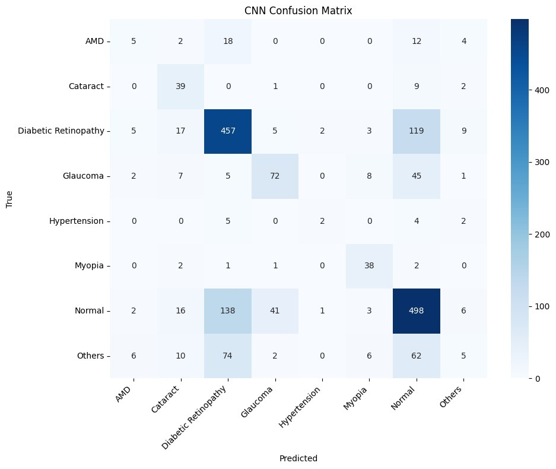
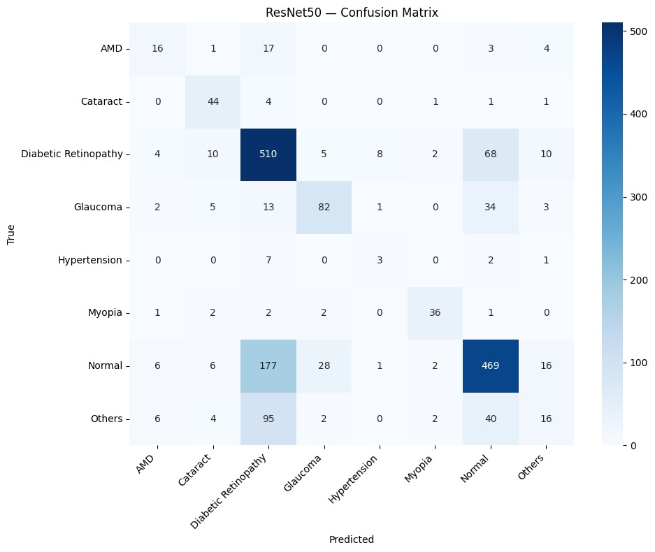
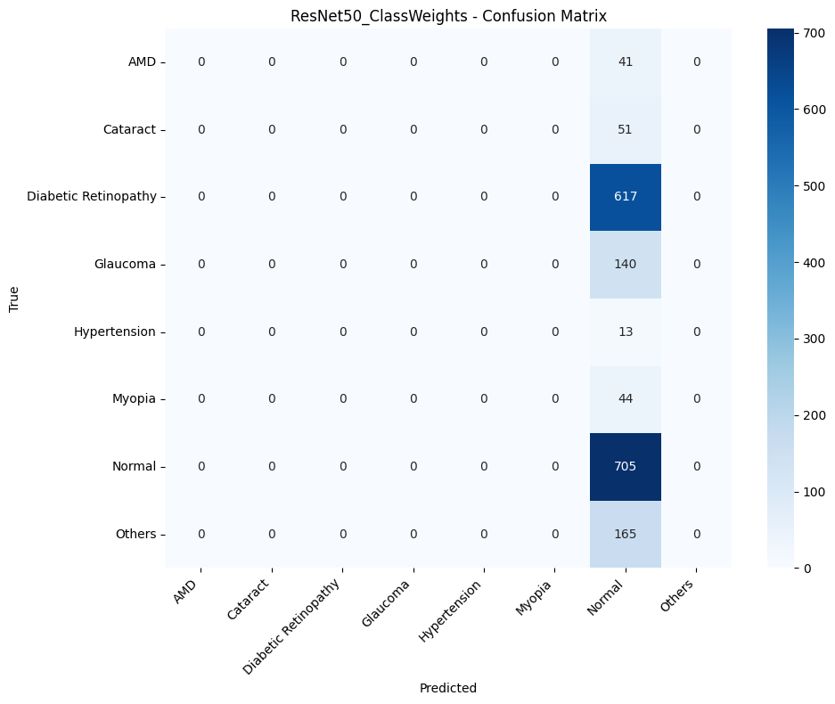
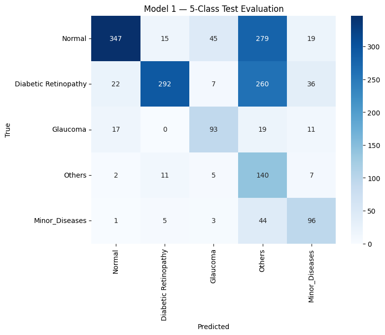
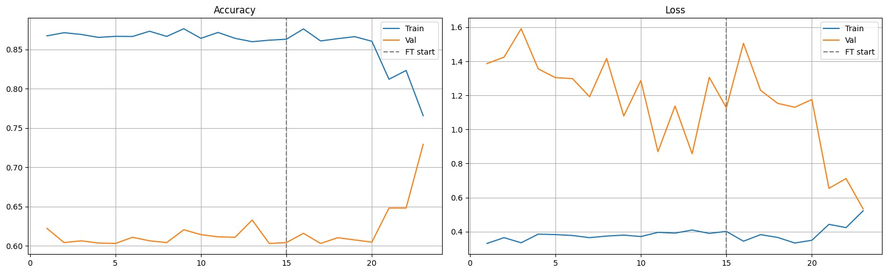
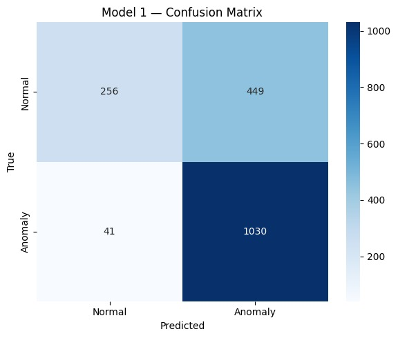
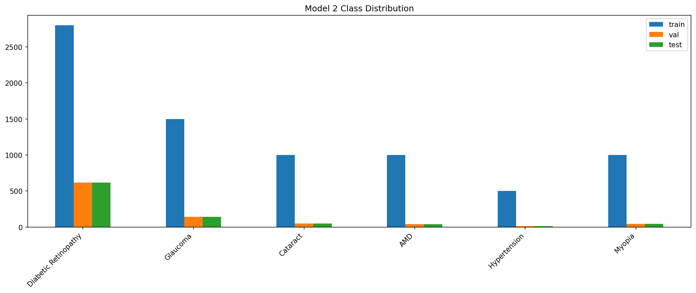
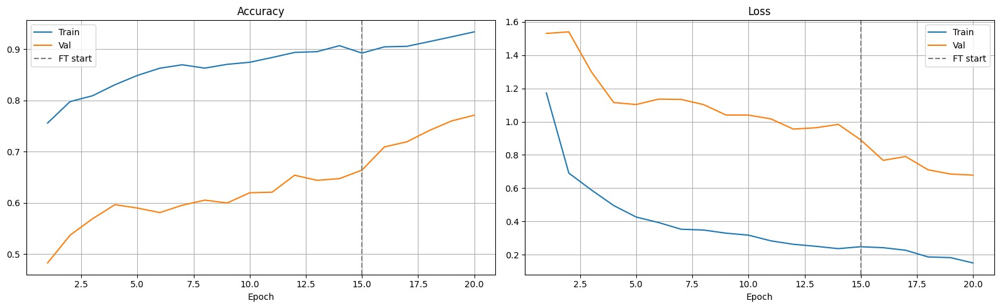
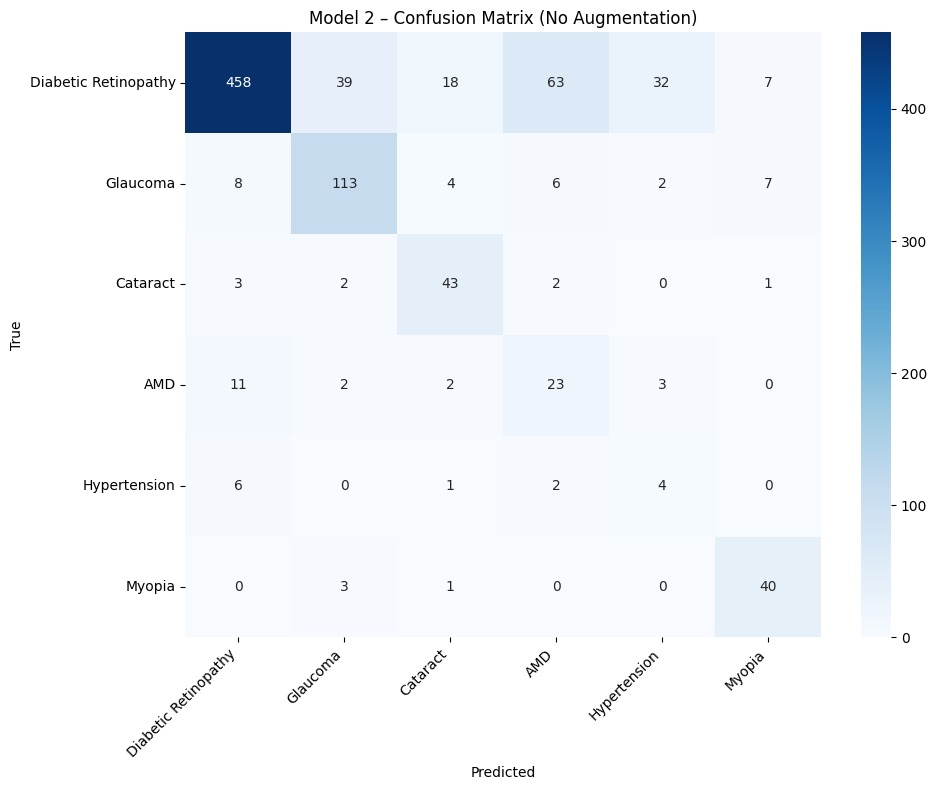

# 🩺 Eye Disease Classification

> A deep learning project for multi-class retinal disease classification, developed through multiple experiments to investigate **class imbalance, minority-class recognition, and hierarchical classification strategies**.

---

## 📌 Project Overview

This project explores the classification of retinal images into multiple eye-disease categories using Deep Learning.

The main challenge was not simply building a classifier — it was dealing with a **highly imbalanced and difficult dataset**, where some classes contained thousands of images while others contained only a few dozen.

Because of this imbalance, a direct 8-class classification approach struggled particularly with minority diseases.

Rather than stopping at the first model, the project evolved through several experiments:

```text
Direct 8-Class Classification
            │
            ▼
     Class Weighting
            │
            ▼
   Hierarchical Classification
            │
            ▼
 Normal vs Anomaly + Disease Classification
```

Each experiment was motivated by limitations observed in the previous one.

The final approach became a **two-stage classification pipeline**:

```text
                    Input Retinal Image
                            │
                            ▼
                  ┌───────────────────┐
                  │     Model 1       │
                  │ Normal / Anomaly  │
                  └─────────┬─────────┘
                            │
                 ┌──────────┴──────────┐
                 │                     │
              Normal                Anomaly
                 │                     │
                 ▼                     ▼
              NORMAL          ┌────────────────┐
                              │    Model 2     │
                              │ Disease Class  │
                              └───────┬────────┘
                                      │
                                      ▼
                         ┌─────────────────────────┐
                         │ DR / Glaucoma /         │
                         │ Cataract / AMD /        │
                         │ Hypertension / Myopia  │
                         └─────────────────────────┘
```

---

# 📊 Dataset

The project uses **11,839 retinal images** collected from multiple publicly available datasets.

| Source    |     Images |
| --------- | ---------: |
| ODIR5K    |      7,000 |
| APTOS2019 |      3,484 |
| ACRIMA    |        705 |
| ORIGA     |        650 |
| **Total** | **11,839** |

### Target Classes

The original dataset contains 8 classes:

* Normal
* Diabetic Retinopathy
* Glaucoma
* Cataract
* AMD
* Hypertension
* Myopia
* Others

---

## ⚠️ Class Imbalance

One of the most important characteristics of the dataset was its severe class imbalance.

| Class                | Images | Percentage |
| -------------------- | -----: | ---------: |
| Normal               |  4,698 |     39.68% |
| Diabetic Retinopathy |  4,113 |     34.74% |
| Others               |  1,102 |      9.31% |
| Glaucoma             |    930 |      7.86% |
| Cataract             |    340 |      2.87% |
| Myopia               |    294 |      2.48% |
| AMD                  |    274 |      2.31% |
| Hypertension         |     88 |      0.74% |

This imbalance became one of the central problems investigated throughout the project.

---

# 🔬 Experiment 1 — Direct 8-Class Classification

### Notebook

`models.ipynb`

The first approach treated the problem as a standard 8-class classification task.

```text
Input Image
     │
     ▼
Preprocessing
     │
     ▼
Data Augmentation
     │
     ▼
Classification Model
     │
     ▼
8-Class Prediction
```

### Data Augmentation

The training pipeline experimented with several augmentation techniques:

* Horizontal Flip
* Shift / Scale / Rotation
* Brightness / Contrast
* Blur
* Gaussian Noise

The dataset was divided into:

```text
Train        → 70%
Validation   → 15%
Test         → 15%
```

Augmentation was applied only to the training set.

### Results

| Metric          |     Result |
| --------------- | ---------: |
| Accuracy        | **62.84%** |
| Macro Precision | **47.56%** |
| Macro Recall    | **48.70%** |
| Macro F1        | **45.67%** |
| Weighted F1     | **60.06%** |

### Classification Report

| Class                | Precision | Recall |     F1 |
| -------------------- | --------: | -----: | -----: |
| AMD                  |    0.2500 | 0.1220 | 0.1639 |
| Cataract             |    0.4194 | 0.7647 | 0.5417 |
| Diabetic Retinopathy |    0.6547 | 0.7407 | 0.6951 |
| Glaucoma             |    0.5902 | 0.5143 | 0.5496 |
| Hypertension         |    0.4000 | 0.1538 | 0.2222 |
| Myopia               |    0.6552 | 0.8636 | 0.7451 |
| Normal               |    0.6631 | 0.7064 | 0.6841 |
| Others               |    0.1724 | 0.0303 | 0.0515 |

### Confusion Matrices

#### CNN



#### ResNet



### Observation

The baseline demonstrated that direct 8-class classification was possible, but minority classes remained difficult to recognize.

In particular, **AMD, Hypertension, and Others** showed substantially weaker F1 scores.

This motivated the next experiment.

---

# ⚖️ Experiment 2 — Class Weights

### Notebook

`models_ClassWeights.ipynb`

The next experiment kept the augmentation strategy and introduced **class-weighted loss**.

The idea was straightforward:

```text
Majority Classes
       │
       ▼
 Lower Training Weight


Minority Classes
       │
       ▼
 Higher Training Weight
```

The goal was to force the model to pay more attention to underrepresented diseases.

### Results

| Metric          |     Result |
| --------------- | ---------: |
| Test Loss       |     4.3096 |
| Accuracy        | **39.70%** |
| Macro Precision |      4.96% |
| Macro Recall    |     12.50% |
| Macro F1        |  **7.10%** |
| Weighted F1     |     22.56% |

### Classification Report

| Class                | Precision | Recall |     F1 |
| -------------------- | --------: | -----: | -----: |
| AMD                  |    0.0000 | 0.0000 | 0.0000 |
| Cataract             |    0.0000 | 0.0000 | 0.0000 |
| Diabetic Retinopathy |    0.0000 | 0.0000 | 0.0000 |
| Glaucoma             |    0.0000 | 0.0000 | 0.0000 |
| Hypertension         |    0.0000 | 0.0000 | 0.0000 |
| Myopia               |    0.0000 | 0.0000 | 0.0000 |
| Normal               |    0.3970 | 1.0000 | 0.5683 |
| Others               |    0.0000 | 0.0000 | 0.0000 |

### Confusion Matrix



### Observation

The experiment did not improve minority-class recognition.

Instead, the model effectively collapsed its predictions toward the **Normal** class.

This experiment was important because it demonstrated that simply increasing the loss contribution of minority classes was not sufficient for this dataset.

---

# 🧩 Experiment 3 — Hierarchical Classification

### Notebook

`models_2Models.ipynb`

After observing the difficulty of the direct 8-class problem, the classification task was reorganized hierarchically.

Instead of asking one model to distinguish between all 8 classes, the first model grouped the smaller diseases together.

### Model 1 — 5 Classes

The first model classified:

* Normal
* Diabetic Retinopathy
* Glaucoma
* Others
* Minor_Diseases

Where:

```text
Minor_Diseases =
    Cataract
    AMD
    Hypertension
    Myopia
```

The architecture became:

```text
                    Input Image
                         │
                         ▼
                    Model 1
                    5 Classes
                         │
        ┌────────────────┼────────────────┐
        │                │                │
      Normal             DR           Glaucoma
        │                │                │
        └────────────────┼────────────────┘
                         │
                     Others
                         │
                  Minor_Diseases
                         │
                         ▼
                    Model 2
                    4 Classes
                         │
             ┌───────────┼───────────┐
             │           │           │
          Cataract      AMD     Hypertension
                                     │
                                   Myopia
```

### Model 1 Results

| Metric          |     Result |
| --------------- | ---------: |
| Accuracy        | **54.50%** |
| Macro Precision | **63.21%** |
| Macro Recall    | **62.45%** |
| Macro F1        | **56.06%** |

| Class                | Precision | Recall |     F1 |
| -------------------- | --------: | -----: | -----: |
| Normal               |    0.8920 | 0.4922 | 0.6344 |
| Diabetic Retinopathy |    0.9040 | 0.4733 | 0.6213 |
| Glaucoma             |    0.6078 | 0.6643 | 0.6348 |
| Others               |    0.1887 | 0.8485 | 0.3087 |
| Minor_Diseases       |    0.5680 | 0.6443 | 0.6038 |

### Confusion Matrix



### Why This Experiment Was Not Completed

The second-stage model was intended to classify the `Minor_Diseases` group into:

```text
Cataract
AMD
Hypertension
Myopia
```

However, the second-stage training did not complete successfully.

The validation loss became:

```text
val_loss = NaN
```

Therefore, the complete hierarchical pipeline could not be used as the final solution.

### Important

This experiment was **not discarded from the project history**.

It became an important step in understanding how the dataset behaved and why the classification problem needed to be reformulated.

---

# 🔀 Experiment 4 — Binary + Multi-Class Classification

### Notebooks

* `new_models_1.ipynb`
* `new_models_2.ipynb`

After the previous experiments, the problem was reformulated into two more focused stages.

Instead of directly predicting one of eight classes:

```text
8-Class Classification
```

the system first asks:

```text
Is the eye Normal or Anomalous?
```

and only then performs disease classification.

---

# 🥇 Model 1 — Normal vs Anomaly

The first model performs binary classification:

```text
Normal
   vs
Anomaly
```

The anomaly group contains:

* Diabetic Retinopathy
* Glaucoma
* Cataract
* AMD
* Hypertension
* Myopia
* Others

### Results

| Metric            |     Result |
| ----------------- | ---------: |
| Accuracy          | **72.41%** |
| Anomaly Precision | **69.64%** |
| Anomaly Recall    | **96.17%** |
| Anomaly F1        | **80.78%** |
| Macro Precision   | **77.92%** |
| Macro Recall      | **66.24%** |
| Macro F1          | **65.94%** |
| Weighted F1       | **69.00%** |

### Classification Report

| Class   | Precision | Recall |     F1 |
| ------- | --------: | -----: | -----: |
| Normal  |    0.8620 | 0.3631 | 0.5110 |
| Anomaly |    0.6964 | 0.9617 | 0.8078 |

### Accuracy



### Confusion Matrix



### Role in the Final Pipeline

This model acts as the **screening stage**.

Its main purpose is to determine whether the input belongs to the Normal group or should be passed to the disease classifier.

---

# 🧬 Model 2 — Disease Classification

### Notebook

`new_models_2.ipynb`

The second model receives the disease/anomaly cases and focuses specifically on named diseases.

For this stage, the `Normal` and `Others` classes were removed.

The model therefore focuses on:

* Diabetic Retinopathy
* Glaucoma
* Cataract
* AMD
* Hypertension
* Myopia

### Dataset Distribution



### Results

| Metric          |     Result |
| --------------- | ---------: |
| Accuracy        | **75.00%** |
| Macro Precision | **56.00%** |
| Macro Recall    | **70.00%** |
| Macro F1        | **60.00%** |
| Weighted F1     | **78.00%** |

### Classification Report

| Class                | Precision | Recall |   F1 |
| -------------------- | --------: | -----: | ---: |
| Diabetic Retinopathy |      0.94 |   0.74 | 0.83 |
| Glaucoma             |      0.71 |   0.81 | 0.76 |
| Cataract             |      0.62 |   0.84 | 0.72 |
| AMD                  |      0.24 |   0.56 | 0.34 |
| Hypertension         |      0.10 |   0.31 | 0.15 |
| Myopia               |      0.73 |   0.91 | 0.81 |

### Accuracy



### Confusion Matrix



### Observation

The model showed stronger performance on several relatively better-represented disease classes, while very small classes — particularly **Hypertension and AMD** — remained challenging.

This behavior is consistent with the severe class imbalance observed earlier in the project.

---

# 🏗️ Final Architecture

The final system combines both models into one inference pipeline:

```text
                         Input Image
                              │
                              ▼
                  ┌─────────────────────┐
                  │       Model 1       │
                  │   Normal / Anomaly  │
                  └──────────┬──────────┘
                             │
                 ┌───────────┴───────────┐
                 │                       │
                 ▼                       ▼
              Normal                  Anomaly
                 │                       │
                 ▼                       ▼
              NORMAL              ┌──────────────┐
                                  │   Model 2    │
                                  │    Disease   │
                                  │ Classification│
                                  └──────┬───────┘
                                         │
                ┌────────────┬───────────┼───────────┬────────────┐
                ▼            ▼           ▼           ▼            ▼
               DR        Glaucoma     Cataract      AMD     Hypertension
                                                                    │
                                                                    ▼
                                                                  Myopia
```

### Decision Process

**Step 1 — Screening**

```text
Is the eye Normal or Anomaly?
```

If:

```text
Normal
   ↓
Normal
```

If:

```text
Anomaly
   ↓
Send image to Model 2
```

---

**Step 2 — Disease Classification**

Model 2 predicts one of:

```text
Diabetic Retinopathy
Glaucoma
Cataract
AMD
Hypertension
Myopia
```

---

# 📈 Experiment Comparison

| Experiment   | Strategy                                | Main Result                                            |
| ------------ | --------------------------------------- | ------------------------------------------------------ |
| Experiment 1 | Direct 8-Class + Augmentation           | Accuracy: **62.84%** / Macro F1: **45.67%**            |
| Experiment 2 | Augmentation + Class Weights            | Accuracy: **39.70%** / Macro F1: **7.10%**             |
| Experiment 3 | Hierarchical Classification             | Model 1 Accuracy: **54.50%** / Stage 2 failed with NaN |
| Experiment 4 | Normal/Anomaly → Disease Classification | Model 1: **72.41%** / Model 2: **75.00%**              |

> **Important:** The reported 72.41% and 75.00% accuracies are stage-level metrics. They are **not an end-to-end 8-class accuracy**.

---

# 🧠 What This Project Demonstrates

This project was not built around a single training run.

The development process involved repeatedly identifying a limitation, formulating a new strategy, training it, evaluating the results, and using those results to determine the next direction.

The main lessons from the experiments were:

### 1. Accuracy alone was not enough

Because of the severe class imbalance, overall accuracy could hide poor performance on minority diseases.

For this reason, the project also tracked:

* Precision
* Recall
* F1-score
* Macro averages
* Weighted averages
* Confusion matrices

---

### 2. Data imbalance significantly affected minority classes

The original dataset contained:

```text
Normal             → 39.68%
Diabetic Retinopathy → 34.74%
Hypertension       → 0.74%
```

This difference strongly affected the ability to recognize smaller classes.

---

### 3. Class weighting was not a universal solution

Although class weights were introduced specifically to address imbalance, the resulting experiment performed substantially worse.

This demonstrated that increasing minority-class loss weights alone was not enough to solve the underlying classification difficulty.

---

### 4. Reformulating the problem changed the learning task

The final approach transformed:

```text
One difficult 8-class decision
```

into:

```text
Stage 1
Normal vs Anomaly

        +

Stage 2
Disease vs Disease
```

This allowed each model to focus on a more specific classification problem.

---

### 5. Failed experiments were part of the development process

The hierarchical model was not able to complete its second stage because the validation loss became `NaN`.

Instead of hiding this experiment, it is documented because it explains **why the project moved toward a different architecture**.

---

# 🗂️ Project Structure

```text
EyeDisease/
│
├── Data/
│
├── docs/
│   ├── class_distribution.png
│   ├── class_w_cm.png
│   ├── cnn_cm.jpeg
│   ├── model1_acc.jpeg
│   ├── model1_cm.jpeg
│   ├── model1_hir_cm.png
│   ├── model2_cm.jpeg
│   ├── models2_acc.jpeg
│   └── resnet_cm.jpeg
│
├── notebooks/
│   ├── EDA.ipynb
│   ├── models.ipynb
│   ├── models_ClassWeights.ipynb
│   ├── models_2Models.ipynb
│   ├── new_models_1.ipynb
│   ├── new_models_2.ipynb
│   └── splits.ipynb
│
├── .gitattributes
├── .gitignore
├── README.md
└── requirements.txt
```

---

# 🛠️ Technologies

* Python
* TensorFlow
* Keras
* NumPy
* Pandas
* Scikit-learn
* OpenCV
* Matplotlib

---

# 📚 Project Workflow

The overall development process can be summarized as:

```text
Dataset
   │
   ▼
Exploratory Data Analysis
   │
   ▼
Identify Class Imbalance
   │
   ▼
Data Splitting
   │
   ▼
8-Class Baseline
   │
   ▼
Augmentation
   │
   ▼
Class Weight Experiment
   │
   ▼
Hierarchical Classification
   │
   ▼
Analyze Failure
   │
   ▼
Problem Reformulation
   │
   ▼
Normal vs Anomaly
   │
   ▼
Disease Classification
   │
   ▼
Final Two-Stage Pipeline
```

---

# 📝 Conclusion

The main challenge of this project was not simply achieving a high classification accuracy.

The challenge was understanding **why the models struggled**, especially with minority diseases, and iteratively redesigning the problem around those limitations.

The experiments progressed from:

```text
Direct 8-Class Classification
```

to:

```text
Class-Weighted Classification
```

then:

```text
Hierarchical Classification
```

and finally:

```text
Normal vs Anomaly
          ↓
Disease Classification
```

The final system therefore represents an **iterative experimental process**, where unsuccessful experiments were used to understand the dataset and guide the next modeling decision.

> **The project is intentionally documented as an experimental journey rather than only presenting the final model, because the failures, comparisons, and architectural changes are an important part of the work.**

---

## 🚀 Future Improvements

Potential next steps include:

* Improving minority-class representation
* Further investigating AMD and Hypertension
* Experimenting with transfer learning and fine-tuning
* Exploring stronger augmentation strategies
* Improving end-to-end evaluation of the two-stage pipeline
* Investigating confidence thresholds between Model 1 and Model 2
* Adding an inference/demo interface
* Tracking experiment configurations and results more systematically

---

## 👤 Author

**Mahmoud Shoaib**

Computer Science Student | AI Engineer

GitHub: [@mahmoudshoip94](https://github.com/mahmoudshoip94)

---

## ⭐ Project Philosophy

> **Build → Evaluate → Understand → Experiment → Improve**

This repository documents that process.
